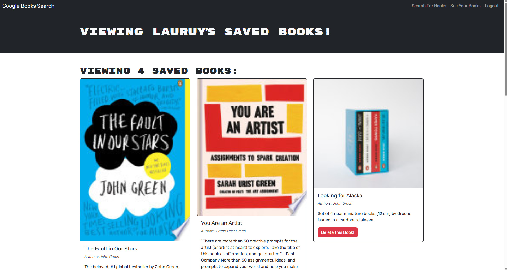

# Book-Search-Engine
# Book-Search-Engine

[](https://opensource.org/licenses/MIT) - https://opensource.org/licenses/MIT

## Table of Contents 
[Description](#description)

[Installation](#installation)

[Usage](#usage)

[Tests](#tests)

[License](#license)

[Questions](#questions)

[Resources](#resources)

&nbsp;&nbsp;&nbsp;&nbsp;&nbsp;[3rd-Party Software](#3rd-party-software)

[Screenshots](#screenshots)

[Render Deployed Version](#render-deployed-version)


## Description
The Book-Search-Engine is a full-stack web application that allows users to search for books using the Google Books API and save their favorite books to a personal list. The application is built with a React frontend and an Express/Node.js backend, and it uses MongoDB for data storage. Users can create an account, log in, search for books, and manage their saved books. The application also features JWT authentication to secure user data and interactions.

Key features include:
- User authentication and authorization with JWT
- Search functionality powered by the Google Books API
- Ability to save and remove books from a personal list
- Responsive design for optimal viewing on different devices
- Integration with Apollo Client for managing GraphQL queries and mutations

This project demonstrates the use of modern web development technologies and best practices, including React, GraphQL, Apollo Client, Express, Node.js, and MongoDB.

## Installation
**Note: The app does not need to be installed unless you wish to run the app locally on your machine. To just use the app go to https://book-search-engine-62x0.onrender.com** 

To install this application, follow these steps:
1. **Clone the repository:**
   ```sh
   git clone https://github.com/Lauren245/book-search-engine.git
   cd book-search-engine

2. **Install dependencies:** Navigate to the root directory of the project and install the necessary dependencies using ```npm install```

3. **Set up environment variables:** Create a .env file in the root directory and add the following environment variables, be sure to replace the placeholder values: 
```MONGODB_URI=<your-mongodb-uri> JWT_SECRET=<your-jwt-secret>```

4. **Build the project** Use the ```npm run build``` command at the root level to build the application.

5. **Run the application** Use the ```npm run develop``` command at the root level to run the application.

## Usage
To use the Book-Search-Engine application, follow these steps:

1. **Create an account:**
   - Click on the "Sign Up" button.
   - Fill in the required information (username, email, and password).
   - Click "Submit" to create your account.

2. **Log in:**
   - Click on the "Log In" button.
   - Enter your username and password.
   - Click "Submit" to log in to your account.

3. **Search for books:**
   - Use the search bar to enter the name of a book you are looking for.
   - Click the "Search" button to view the search results.

4. **Save books to your personal list:**
   - Browse the search results and find the books you want to save.
   - Click the "Save" button next to the book to add it to your personal list.

5. **View and manage your saved books:**
   - Click on the "Saved Books" link in the navigation menu to view your saved books.
   - You can remove books from your list by clicking the "Remove" button next to each book.

6. **Log out:**
   - Click on the "Log Out" button to log out of your account.

## Tests
There are currently no unit tests for this application. All functionality can be tested manually.

## License
Copyright 2025 Lauren Moore

This software uses an [MIT license](https://opensource.org/license/MIT).

## Questions
If you have additional questions, you can contact me at: 

GitHub: [Lauren245](https://github.com/Lauren245)

Email: laurenmoorejm@gmail.com

## Resources

### 3rd-Party Software
## Resources

### 3rd-Party Software
- **[React](https://reactjs.org/)**: A JavaScript library for building user interfaces.
- **[Express](https://expressjs.com/)**: A minimal and flexible Node.js web application framework.
- **[Node.js](https://nodejs.org/)**: A JavaScript runtime built on Chrome's V8 JavaScript engine.
- **[MongoDB](https://www.mongodb.com/)**: A NoSQL database for storing user and book data.
- **[Apollo Client](https://www.apollographql.com/docs/react/)**: A comprehensive state management library for JavaScript that enables you to manage both local and remote data with GraphQL.
- **[GraphQL](https://graphql.org/)**: A query language for your API, and a server-side runtime for executing queries by using a type system you define for your data.
- **[JWT (JSON Web Token)](https://jwt.io/)**: A compact, URL-safe means of representing claims to be transferred between two parties.
- **[Google Books API](https://developers.google.com/books/docs/v1/getting_started)**: An API provided by Google to search for books and retrieve book information.
- **[dotenv](https://www.npmjs.com/package/dotenv)**: A zero-dependency module that loads environment variables from a `.env` file into `process.env`.
- **[nodemon](https://nodemon.io/)**: A tool that helps develop Node.js based applications by automatically restarting the node application when file changes in the directory are detected.

## Screenshots

**Image of the saved books for a user.**


## Render Deployed Version
[Click here](https://book-search-engine-62x0.onrender.com) to view the app as deployed on Render.
*Note: since it is being hosted on a free tier, it will take a while for the app to load when opening it for the first time.*

--- 
**[Back to Top](#book-search-engine)**